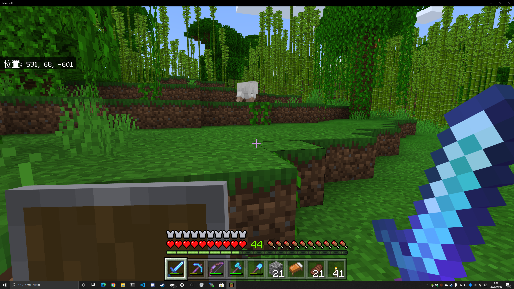

# マークダウンサンプル記事

こんにちはあやたかです。今回はあああああああああああああああああああああああああああああああああああああああああああああああああああああああああああああああああ

## サンプル

サンプル本文

- foo
- bar





# [グーグル](http://www.google.com)

```js
var name = "World"
console.warn("Hello, " + name + "!")
```

```java
public class Sample {
　public static void main(String[] args) {
　　System.out.print("奇数：");
　　outputOdd();
　　System.out.print("\n偶数：");
　　outputEven();
　}

　static void outputOdd() {
　　for (int i = 0; i < 10; i++) {
　　　if (i % 2 == 1) {
　　　　System.out.print(i + ",");
　　　}
　　}
　}

　static void outputEven() {
　　for (int i = 0; i < 10; i++) {
　　　if (i % 2 == 0) {
　　　　System.out.print(i + ",");
　　　}
　　}
　}
}
```

aaaaaaaaa
