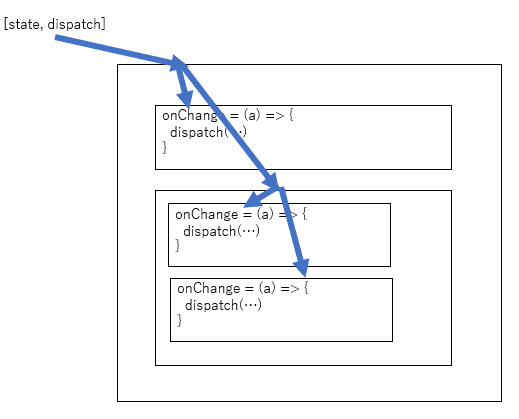

# ReactでuseReducerのdispatchをpropsでどこまで流すのか。

## 前置き

Reactで少し階層が深いコンポーネントにおいてuseReducerのdispatchをどの階層まで渡すべきか。どこでイベントハンドラを書くのか。その辺について検討する場面があったので、記録しておく。

## 結論

- 再利用しないコンポーネントまではdispatchを流してもいい。
- あるいはそもそもdispatch+ロジックを書く層と表示層を完璧に分断する。

## 過程

まずuseReducerについてこれを読んだ。

- [useReducerの本質：良いパフォーマンスのためのロジックとコンポーネント設計](https://qiita.com/uhyo/items/cea1bd157453a85feebf)

useReducerを用いて状態の更新関数を状態に非依存にすることによって、React.memoによるパフォーマンス改善に大きく役立つという話だった。React触り始めの私はこれに飛びつきdispatchをそのまま流した。感覚的に完全な末端までは流さなかったが、ざっくり次の図のようになった。

翌週、子コンポーネントを別の用途で使いたくなった。しかしdispatchと密結合なので当然そのままでは再利用できず困った。次に私はdispatchとそれを使う関数を親コンポーネントで作成し、それを流すことにした。

これによって再利用できるようになった。ではどのコンポーネントまで再利用性を考慮するのか。要はdispatchをそのまま流すとパフォーマンスは確かに簡単にあげられるけど、再利用性が落ちることとトレードオフであるというだけの話ですが。

dispatchをどこまで流すのかについて検討しているところ、「Presentational and Container Components」という考え方があることがわかった。見た目の表示と状態管理を層で完全に分離するという考え方を2015年の時点でDan Abramov氏が提唱していた。

- [Presentational and Container Components](https://medium.com/@dan_abramov/smart-and-dumb-components-7ca2f9a7c7d0)

しかし上記ページの冒頭に2019年にこのような追記がなされている。(DeepL翻訳)

>2019年からの更新：この記事を書いたのはかなり前のことで、私の見解はその後進化しています。特に、私はもうこのようにコンポーネントを分割することをお勧めしません。あなたのコードベースでそれが自然であることを見つけるならば、このパターンは便利です。しかし、私はこのパターンが必要もなく、ほぼ独断的な熱烈さで強要されているのを何度も見てきました。私がこのパターンを便利だと感じた主な理由は、複雑なステートフルロジックをコンポーネントの他の側面から切り離すことができたからです。フックは、任意の分割なしに同じことをさせてくれました。この文章は歴史的な理由からそのままにしていますが、あまり深刻に受け止めないでください。

少人数で開発しているうちは「再利用しないコンポーネントまではdispatchを流してもいい。」程度で問題ないが、関わる人が多くなると厳密なルールがより重要になるのでPresentational and Container Componentsのようにルール化して層分離すべきではないかというのがひとまずの結論。後者の方がソースの部分的な分量自体は多くなるというデメリットはあるが、規模が大きくなるほど再利用性とわかりやすさのメリットがそれを上回るだろう。

## 蛇足

最適化について調査しているときに次の記事が目にとまった。いわく、Reactは速いから、ほとんどの場合不要なレンダリングの最適化は気にすることはないと。

- [When to useMemo and useCallback](https://kentcdodds.com/blog/usememo-and-usecallback)

