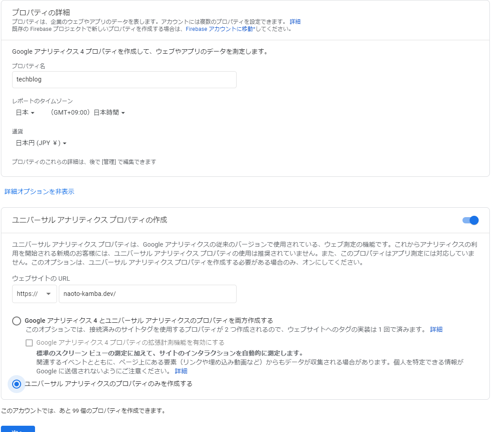
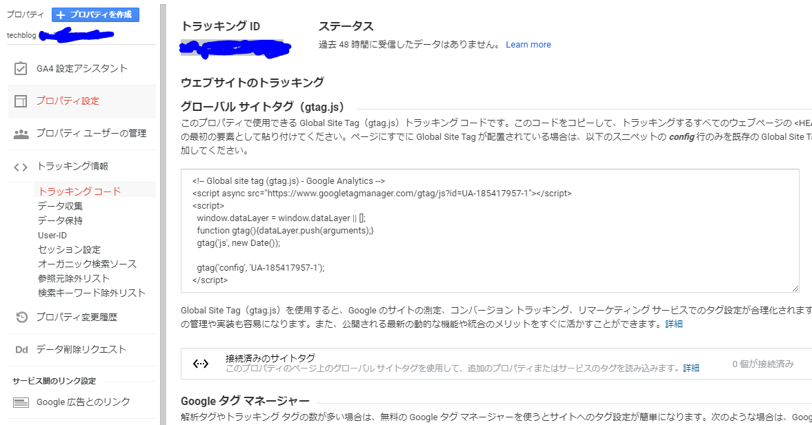
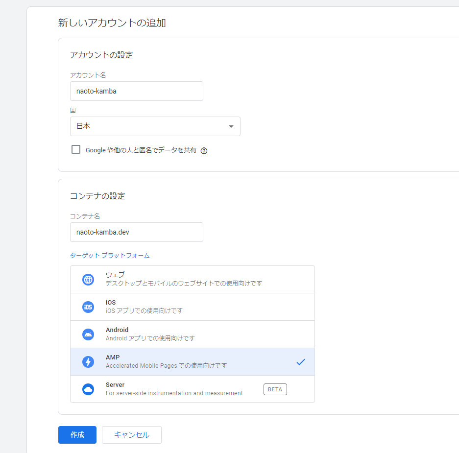
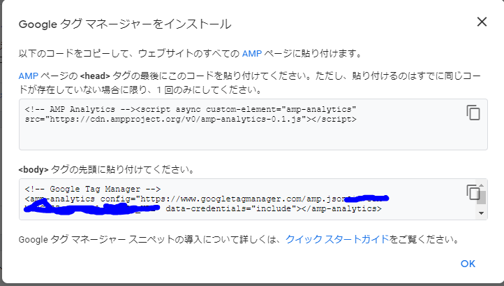
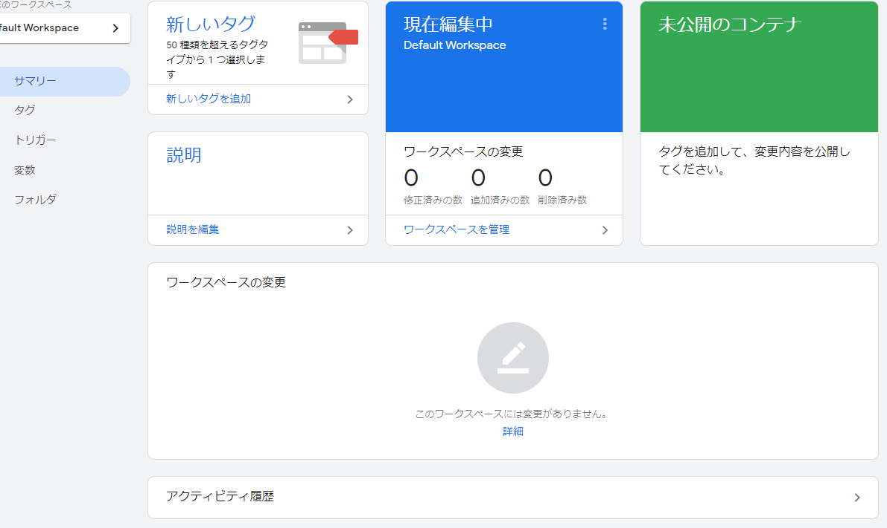
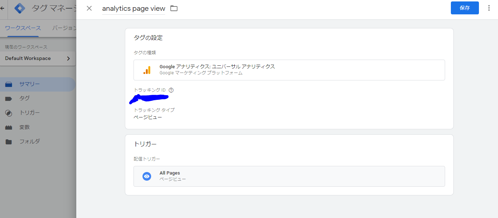
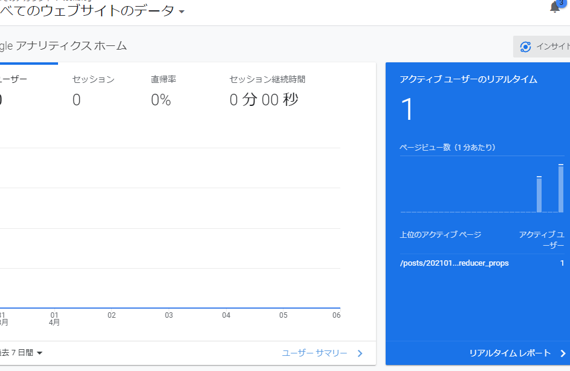

# Amp で作成したブログページに GoogleAnalytics を設定する

## 前置き

先日作成した当 Blog に Google Analytics を設定する。AMP なので、通常と違う手順が必要になるかもしれない。実際に作業しながら、過程を記録する。
**追記: 2021/04/07 現在、Google Analytics 4 は Amp に対応していないので、旧 Google Analytics の設定手順となる。**

## Google Analytics

Google の[アナリティクスのスタートガイド](https://support.google.com/analytics/answer/1008015?hl=ja&ref_topic=3544906)に従って進める。

### アナリティクスアカウントの作成

ガイドの 1.でアナリティクスアカウントを作成するかアカウントにログインとある。Google のアカウントは持っているのでログインし、それとは別にアナリティクスアカウントを作成する必要がある。ここでアナリティクスアカウントとはどういう単位で作るべきものか迷ったので、[アカウントの構成例](https://support.google.com/analytics/answer/1102152?hl=ja)を読んだ。そして小規模なのでひとまず「1 人または 1 つの組織が所有するすべてのプロパティをトラッキングする」という構成で行うことにし、アカウント名を naoto-kamba にした。

### プロパティの設定

ガイドの 2.でプロパティを設定するとある。しかしその前のアナリティクスアカウント作成時にプロパティを聞かれた。そもそもプロパティとは何か。[プロパティについて](https://support.google.com/analytics/answer/2649554?hl=ja)を読んで、ユーザー数やスクリーン表示回数などを計測する際の 1 グループを 1 プロパティとして割り当てると解釈した。プロパティ名は techblog としておいたが、怪しい。[プロパティを編集する](https://support.google.com/analytics/answer/3467852?hl=ja)によるとプロパティ名は後から変えられるということなので、とりあえずこれで行く。

**Google Analytics 4 　は 2021/04/07 現在、Amp に対応していない。**
詳細オプションの表示をクリックし、ユニバーサルアナリティクスのプロパティのみ作成する。もし上記作業の段階で詳細オプションの表示がなければ、プロパティを作り直す。



作成したら、トラッキング ID を控えておく。



### タグ設定

グローバルサイトタグを使う方法と Google タグマネージャを使う方法、どちらかを選ぶ必要があった。違いがわからなかったので、[Google タグ マネージャーと gtag.js](https://support.google.com/tagmanager/answer/7582054?hl=ja)を読んだ。モバイルアプリに対応しているなど、Google タグマネージャの方ができることが多いようにみえたので、今後の勉強もかねて Google タグマネージャを使うことにした。次の項目に書く。

## Google タグマネージャ

[タグ マネージャーの設定とインストール](https://support.google.com/tagmanager/answer/6103696?hl=ja&ref_topic=3441530)を参照して作業を進める。

### タグマネージャアカウントおよびコンテナ作成

google タグマネージャのアカウントを新規で作成した。同時にコンテナも作成された。



### タグマネージャをインストール

「Google タグ マネージャーをインストール」から画面を開き、埋め込むべきタグを表示する。


TypeScript を使っているので、型定義ファイルに追記。

```TypeScript
  interface AmpAnalytics {
    config: string
    'data-credentials': string
  }

  interface IntrinsicElements {
    'amp-analytics' : AmpAnalytics
  }
```

\_document.tsx の head と body に、先ほど表示したタグを埋め込む。

```jsx
<Html lang="ja">
  <Head>
    <script
      async
      custom-element="amp-analytics"
      src="https://cdn.ampproject.org/v0/amp-analytics-0.1.js"
    ></script>
  </Head>
  <body>
    <amp-analytics
      config="https://www.googletagmanager.com/amp.json?id=*****&gtm.url=SOURCE_URL"
      data-credentials="include"
    ></amp-analytics>

    <Main />
    <NextScript />
  </body>
</Html>
```

デプロイしてページを確認したところ、タグは追加されていたがコンソールに CORS ERROR が表示された。
まだコンテナが未公開のため、情報を受信できていないらしい。


### タグマネージャに Google Analytics を設定する

タグマネージャを開き、新規タグを作成をクリック。GoogleAnalytics を選択肢、控えていた Analytics ID を入力。トリガーに All Pages を指定して保存。



画面右上の公開ボタンを押してバージョン名を記述し、もう一度公開ボタンを押す。

### 動作確認

ページを自分で開き、Google Analytics のホームでリアルタイムビューが生え始めたことを確認する。



以上。
