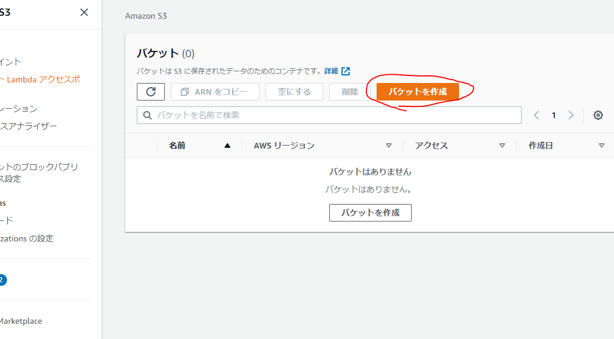
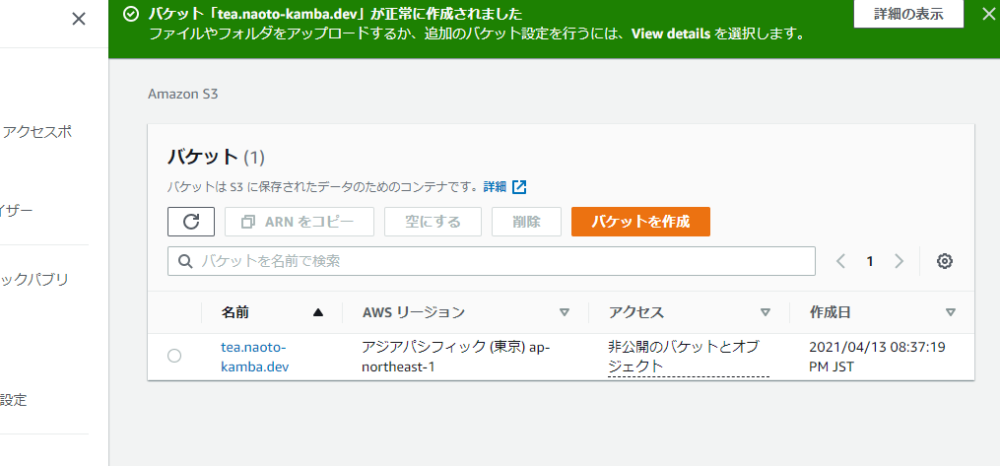
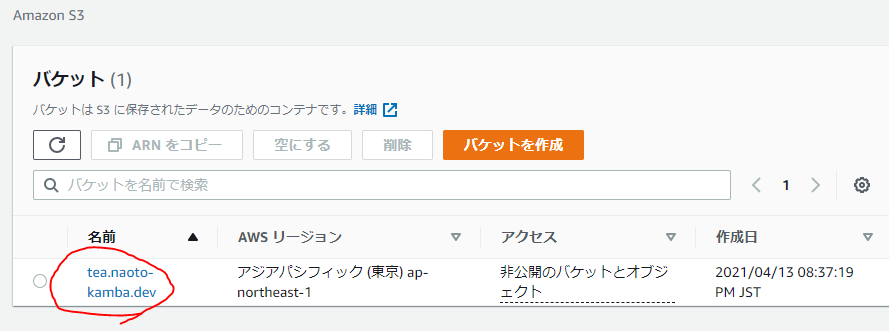
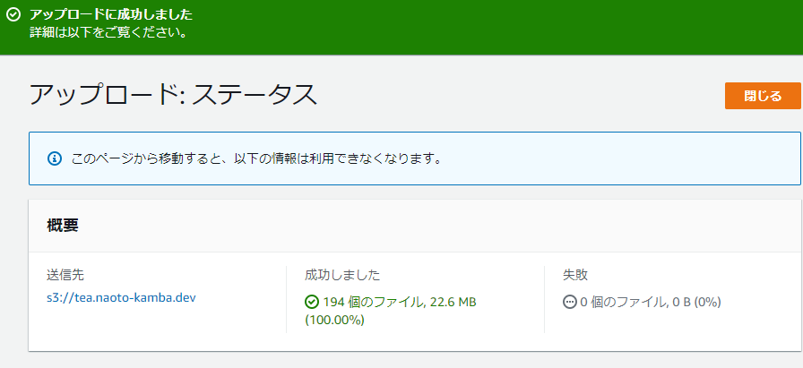
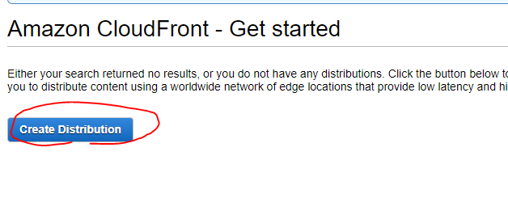
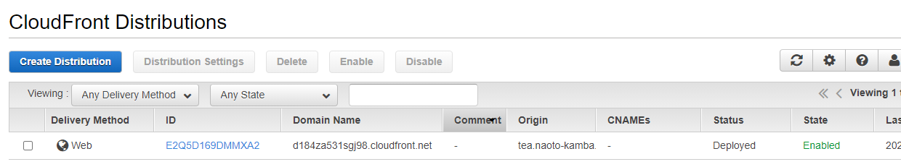
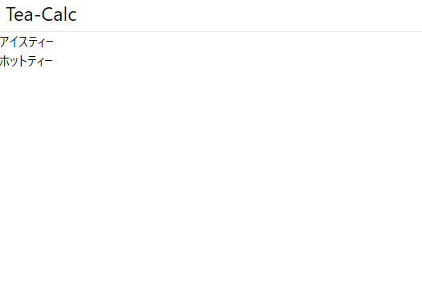

# AWS S3 + CloudFront を使って Web サイトを ホスティングする

## 前置き

AWS を使ってみたかったというの理由で、next.js で作成したアプリを AWS Amazon S3 + CloudFront を使って ホスティングするまでを記録する。
続編で 独自ドメインを適用して、Https 化する予定。

前提

- AWS のアカウントは持っていること
- アップロードするファイルの準備が整っていること

今回対象とするリポジトリはこれ →[/naoto-kamba/tea](https://github.com/naoto-kamba/tea)

## Amazon S3

### バケットの作成

[Amazon S3 UserGuide](https://docs.aws.amazon.com/ja_jp/AmazonS3/latest/userguide/Welcome.html)を読みながら進めた。

#### バケット作成

S3 の画面から、バケットを作成 をクリックし、作成を開始した。

バケットの命名をする。バケット名は一意でなければならない。また[CloudFront + S3 で静的サイトを運用する際の注意点](https://qiita.com/ooxif/items/d28b7caf72bf5290588c)、という記事にもあるように CloudFront 想定の場合サブディレクトリのインデックスファイルが使えない。ゆえに命名は静的サイト一つを想定して行うべきであることがわかる。
本記事では設定しないが、後ほど使用予定のドメイン「tea.naoto-kamba.dev」 とした。

それ以外の項目はすべてデフォルトとした。ブロックパブリックアクセス設定に関しても、CloudFront を使用する場合はデフォルトの全ブロックでよい。

バケットの作成が完了した。

### ファイルのアップロード

前提に書いたように、前もってアップロードするファイルはビルドしておく。

S3 の画面から、作成したバケットを選択した。

アップロードを選択した。

ファイルを追加、フォルダの追加で必要なファイルを選択した。
画面をスクロールして一番右下のアップロードをクリックした。

しばらく待つとアップロードが完了した。

## CloudFront

[Amazon CloudFront の開始方法](https://docs.aws.amazon.com/ja_jp/AmazonCloudFront/latest/DeveloperGuide/GettingStarted.html)を読みながら作業する。

CloudFront のトップから Create Distribution を選択した。

- 始めは最低限の項目だけ入力し、後から変更していく。
  - Origin Domain Name
    - 前項で作成した S3 のバケットが選択肢にあるはずなので、それを選ぶ。
  - Restrict Bucket Access
    - Yes  
      (CloudFront を経由しない S3 へのアクセスを 禁ずる)
  - Origin Access Identity
    - Create a New Identity
  - Grant Read Permissions on Bucket
    - Yes, Update Bucket Policy  
      (CloudFront からのアクセスを許可するポリシーをバケットに追加する)
  - Default Root Object
    - index.html  
       (トップページのファイル名)

右下から　 Create Distribution をクリックした。

Status が In Progress となっていた。数分待機したら、Deployed に変わった。

Domain Name にあるアドレスにアクセスしたら S3 でアップロードしたページが表示された。

次回は独自ドメインをこれに設定し、 Https に対応させる。
